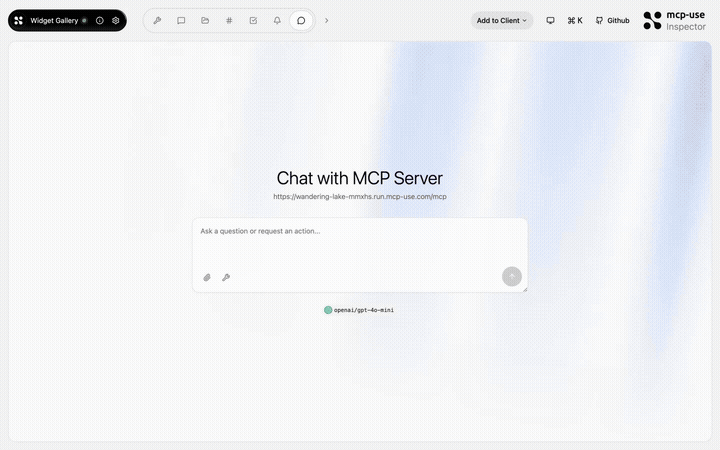
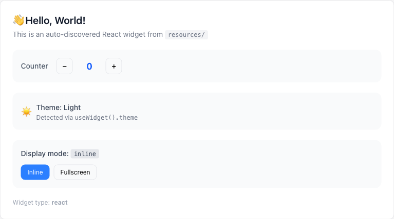

# Widget Gallery — Every widget type in one place

<p>
  <a href="https://github.com/mcp-use/mcp-use">Built with <b>mcp-use</b></a>
  &nbsp;
  <a href="https://github.com/mcp-use/mcp-use">
    
  </a>
</p>

A comprehensive showcase of all mcp-use widget types: React components, HTML widgets, MCP UI poll cards, programmatic counters, and client detection — all in one MCP App.



## Try it now

Connect to the hosted instance:

```
https://wandering-lake-mmxhs.run.mcp-use.com/mcp
```

Or open the [Inspector](https://inspector.manufact.com/inspector?autoConnect=https%3A%2F%2Fwandering-lake-mmxhs.run.mcp-use.com%2Fmcp) to test it interactively.

### Setup on ChatGPT

1. Open **Settings** > **Apps and Connectors** > **Advanced Settings** and enable **Developer Mode**
2. Go to **Connectors** > **Create**, name it "Widget Gallery", paste the URL above
3. In a new chat, click **+** > **More** and select the Widget Gallery connector

### Setup on Claude

1. Open **Settings** > **Connectors** > **Add custom connector**
2. Paste the URL above and save

## Features

- **React widgets** — full React components with state, hooks, and streaming props
- **HTML widgets** — lightweight HTML/CSS widgets for simple content
- **MCP UI polls** — interactive poll cards using the MCP UI spec
- **Programmatic widgets** — widgets created from code (no file needed)
- **Client detection** — detect ChatGPT, Claude, or Inspector and adapt

## Tools

| Tool | Description |
|------|-------------|
| `show-react-widget` | Display an interactive React widget with counter and controls |
| `html-greeting` | Show a styled HTML greeting card |
| `mcp-ui-poll` | Create an interactive poll card |
| `programmatic-counter` | Render a counter widget built from code |
| `detect-client` | Detect the connected client type |

## Available Widgets

| Widget | Preview |
|--------|---------|
| `react-showcase` |  |

## Local development

```bash
git clone https://github.com/mcp-use/mcp-widget-gallery.git
cd mcp-widget-gallery
npm install
npm run dev
```

## Deploy

```bash
npx mcp-use deploy
```

## Built with

- [mcp-use](https://github.com/mcp-use/mcp-use) — MCP server framework

## License

MIT
